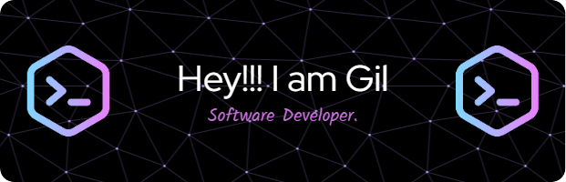

    

 

# About me 👋

Hello!!! I am Gilberto Gutiérrez a technology enthusiast. I from Mexico. I have been working as a software developer since 2017. I have been working since 2017 as a software developer mainly with databases, PL/SQL language and web development.

# Technologies 💻
![Oracle][Oracle]
![PL-SQL][PL-SQL]
![SQL-Loder][SQL-Loder]
![OracleCloud][OracleCloud]
![OracleSQLDev][OracleSQLDev]
![Postgresql][Postgresql]
![PL-PgSQL][PL-PgSQL]
![PgAdmin][PgAdmin]

![NodeJs][NodeJs]
![Typescript][Typescript]
![NestJs][NestJs]
![Graphql][Graphql]
![ApolloGraphql][ApolloClient]
![ReactJs][ReactJs]
![Bootstrap][Bootstrap]

![VsCode][VsCode]
![Notepad][Notepad]

## Repository statistics 📈

  

[Typescript]:https://img.shields.io/badge/%20typescript-3178C6?style=for-the-badge&logo=typescript&logoColor=%23ffffff&labelColor=%233178C6
[Postgresql]:https://img.shields.io/badge/%20postgresql-4169E1?style=for-the-badge&logo=postgresql&logoColor=%23ffffff&labelColor=%234169E1
[PL-PgSQL]:https://img.shields.io/badge/%20PL/PGSQL-4169E1?style=for-the-badge&logo=postgresql&logoColor=%23ffffff&labelColor=%234169E1
[NestJs]:https://img.shields.io/badge/%20nestjs-E0234E?style=for-the-badge&logo=nestjs&logoColor=%23ffffff&labelColor=%23E0234E
[Bootstrap]:https://img.shields.io/badge/%20bootstrap-7952B3?style=for-the-badge&logo=bootstrap&logoColor=%23ffffff&labelColor=%237952B3
[ReactJs]:https://img.shields.io/badge/%20reactjs-61DAFB?style=for-the-badge&logo=react&logoColor=%23ffffff&labelColor=%2361DAFB
[Graphql]:https://img.shields.io/badge/%20graphql-E10098?style=for-the-badge&logo=graphql&logoColor=%23ffffff&labelColor=%23E10098
[ApolloClient]:https://img.shields.io/badge/%20apollo%20Client-311C87?style=for-the-badge&logo=apollographql&logoColor=%23ffffff&labelColor=%23311C87
[NodeJs]:https://img.shields.io/badge/nodejs-339933?style=for-the-badge&logo=nodedotjs&logoColor=%23ffffff&labelColor=%23339933
[VsCode]:https://img.shields.io/badge/VSCode-passing?style=for-the-badge&logo=visualstudiocode&labelColor=%23007ACC&color=%23007ACC
[Oracle]:https://img.shields.io/badge/Oracle-passing?style=for-the-badge&logo=oracle&labelColor=%23F80000&color=%23F80000
[PL-SQL]:https://img.shields.io/badge/PL%2FSQL-passing?style=for-the-badge&logo=oracle&labelColor=%23F80000&color=%23F80000
[SQL-Loder]:https://img.shields.io/badge/SQL*Loder-passing?style=for-the-badge&logo=oracle&labelColor=%23F80000&color=%23F80000
[OracleSQLDev]:https://img.shields.io/badge/Oracle%20SQL%20Developer-passing?style=for-the-badge&logo=oracle&labelColor=%23BDD5DE&color=%23BDD5DE
[PgAdmin]:https://img.shields.io/badge/%20pgadmin-4169E1?style=for-the-badge&logo=postgresql&logoColor=%23ffffff&labelColor=%234169E1
[OracleCloud]:https://img.shields.io/badge/Oracle_Cloud-passing?style=for-the-badge&logo=oracle&labelColor=%23F80000&color=%23F80000
[Notepad]:https://img.shields.io/badge/notepad%2B%2B-passing?style=for-the-badge&logo=notepadplusplus&logoColor=%23000000&labelColor=%2390E59A&color=%2390E59A

<!--
**GtzCode/GtzCode** is a ✨ _special_ ✨ repository because its `README.md` (this file) appears on your GitHub profile.

Here are some ideas to get you started:

- 🔭 I’m currently working on ...
- 🌱 I’m currently learning ...
- 👯 I’m looking to collaborate on ...
- 🤔 I’m looking for help with ...
- 💬 Ask me about ...
- 📫 How to reach me: ...
- 😄 Pronouns: ...
- ⚡ Fun fact: ...
-->
